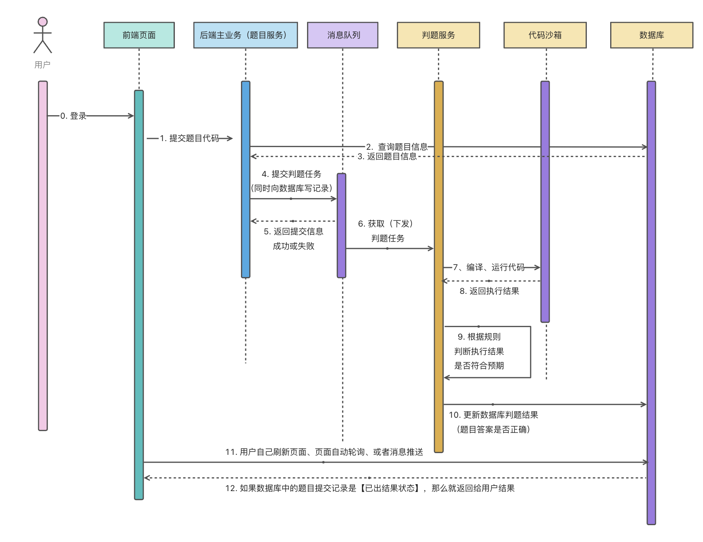

# qyoj后端项目

## 项目介绍
基于 Spring Boot + Spring Cloud 微服务 + Docker的编程题目在线评测系统。在系统前台，管理员可以创建、管理
题目；用户可以自由搜索题目、阅读题目、编写并提交代码。在系统后端，能够根据管理员设定的题目测试用例在 自主实现的代 自
码沙箱 码 中对代码进行编译、运行、判断输出是否正确。其中，代码沙箱可以作为独立服务，提供给其他开发者使用。

### 主流框架 & 特性

- Spring Boot 2.7.x
- Spring MVC
- MyBatis + MyBatis Plus 数据访问（开启分页）
- Spring Boot 调试工具和项目处理器
- Spring AOP 切面编程
- Spring Scheduler 定时任务
- Spring 事务注解

### 数据存储

- MySQL 数据库
- Redis 内存数据库
- Elasticsearch 搜索引擎
- 腾讯云 COS 对象存储

### 工具类

- Easy Excel 表格处理
- Hutool 工具库
- Gson 解析库
- Apache Commons Lang3 工具类
- Lombok 注解

### MySQL 数据库

1）修改 `application.yml` 的数据库配置为你自己的：

```yml
spring:
  datasource:
    driver-class-name: com.mysql.cj.jdbc.Driver
    url: jdbc:mysql://localhost:3306/my_db
    username: root
    password: 123456
```

2）执行 `sql/create_table.sql` 中的数据库语句，自动创建库表

3）启动项目，访问 `http://localhost:8101/api/doc.html` 即可打开接口文档，不需要写前端就能在线调试接口了~


### Redis 分布式登录

1）修改 `application.yml` 的 Redis 配置为你自己的：

```yml
spring:
  redis:
    database: 1
    host: localhost
    port: 6379
    timeout: 5000
    password: 123456
```

2）修改 `application.yml` 中的 session 存储方式：

```yml
spring:
  session:
    store-type: redis
```

3）移除 `MainApplication` 类开头 `@SpringBootApplication` 注解内的 exclude 参数：

修改前：

```java
@SpringBootApplication(exclude = {RedisAutoConfiguration.class})
```

修改后：


```java
@SpringBootApplication
```

### Elasticsearch 搜索引擎

1）修改 `application.yml` 的 Elasticsearch 配置为你自己的：

```yml
spring:
  elasticsearch:
    uris: http://localhost:9200
    username: root
    password: 123456
```

2）复制 `sql/post_es_mapping.json` 文件中的内容，通过调用 Elasticsearch 的接口或者 Kibana Dev Tools 来创建索引（相当于数据库建表）

```
PUT post_v1
{
 参数见 sql/post_es_mapping.json 文件
}
```

这步不会操作的话需要补充下 Elasticsearch 的知识，或者自行百度一下~

3）开启同步任务，将数据库的帖子同步到 Elasticsearch

找到 job 目录下的 `FullSyncPostToEs` 和 `IncSyncPostToEs` 文件，取消掉 `@Component` 注解的注释，再次执行程序即可触发同步：

```java
// todo 取消注释开启任务
//@Component
```

### 项目业务流程图
